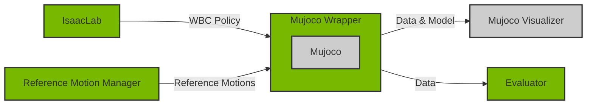

# Neural WBC - Mujoco Wrapper

High level wrapper of Mujoco simulator for use in validating Whole Body Control (WBC) policies
trained in IsaacLab. The wrapper provides convenient interfaces for accessing data and manipulating
the underlying models in Mujoco, as well as an environment that allows comparison with IsaacLab.



## Installation

To use the `neural_wbc.mujoco_wrapper` package, install it with

```bash
${ISAACLAB_PATH:?}/isaaclab.sh -p -m pip install -e neural_wbc/mujoco_wrapper
```

Also install the inference environment with

```bash
${ISAACLAB_PATH:?}/isaaclab.sh -p -m pip install -e neural_wbc/inference_env
```

## Usage

- First ensure that all dependencies are installed using the common script
    [./install_deps.sh](../../install_deps.sh)

- Run the simple viewer with:

    ```sh
    ${ISAACLAB_PATH}/isaaclab.sh -p neural_wbc/inference_env/scripts/mujoco_viewer_player.py
    ```

The viewer is paused on start by default, press `SPACE` key to start simulation or `RIGHT` arrow key
to step forward once. By default this script will load the UniTree H1 robot model scene from
[data/mujoco/models](../data/data/mujoco/models/scene.xml). Additional scripts are provided for running comprehensive evaluation in [scripts](../inference_env/scripts/)
directory.

**NOTE:** The visualization of models is done using a modified version of [mujoco-python-viewer](https://github.com/rohanpsingh/mujoco-python-viewer) with changes to allow
persistent markers for reference motion states. These modifications are bundled in [third_party/mujoco_viewer](../../third_party/mujoco_viewer/) for self containment.

**NOTE:** During internal testing, a few users reported segmentation fault errors when visualization was enabled, although others did not encounter this issue. It is likely due to a dependency mismatch (such as `opengl`, `mujoco`, `nvidia-driver`, etc.), possibly compounded by complications with Conda. We haven't been able to pinpoint the exact cause at the time of release. For users facing this issue, here are a few mitigation options:
1. On top of the `third_party/mujoco_viewer/mujoco_viewer.py`, before importing mujoco, add the following lines:
    ```python
    import os
    os.environ["MUJOCO_GL"] = "egl"
    ```
    This forces MuJoCo to use EGL instead of the default GLX for OpenGL context creation, bypassing display server dependencies.
2. In case option 1 failed, in the `third_party/mujoco_viewer/mujoco_viewer.py:line 460`, you can comment out the following lines:
    ```python
    # marker items
    for _ , marker in self._markers_dict.items():
        self._add_marker_to_scene(marker)
    ```
    This will disable the marker rendering but the robot will still be visualized.

## Deployment

Once sim-to-sim validation is done, the policy can be deployed in simulation or on real robot.
This involves loading the relevant checkpoint and generating actions based on the observations
from the target robot. For real robots, where some quantities are not easily observable like
body orientations, use of a forward dynamics model is necessary.

## Unit Tests

The tests are located in the `tests` directory and can be run with the `unittest` module.

```bash
cd neural_wbc/mujoco_wrapper
${ISAACLAB_PATH:?}/isaaclab.sh -p -m unittest
```
